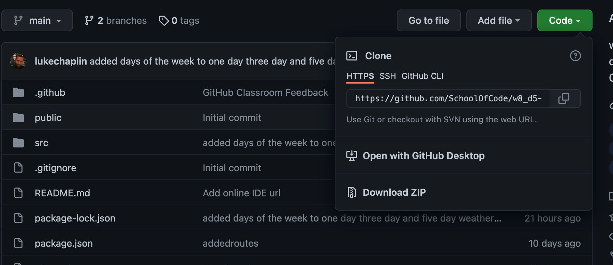
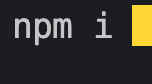
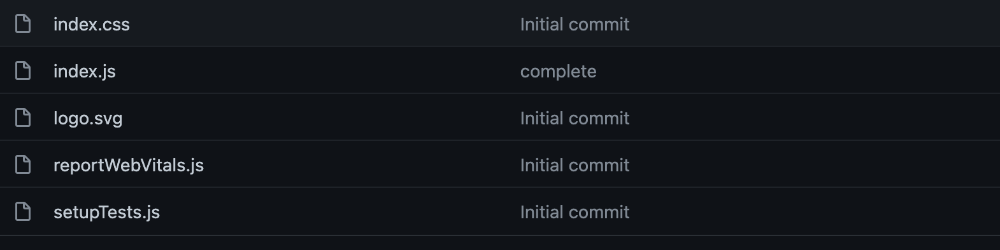

# Weather App

## Contents

1. Getting started
2. Sections
   1. Components
3. Link to deployed site
4. Current Issues

### Getting Started

To open the weather app code base, clone down the code base from github, as shown below.
_NB: Code is public_

Link to github: https://github.com/SchoolOfCode/w8_d5-hackathon_react-app-with-api-data-room-37

_Remember to install npm i dependencies_

### Sections

The below shows the structure of the weather app components and their associated functions.

#### Components

Weather app

1. Src

2. Standard React JS files where components are called to the DOM, see screeshot below (_do not need to alter_)

3. Components

   1. App Where useState for weather data and useEffect which contains the fetch for the API that contains the weather JSON is called. _(Also where all components are called and will placed in render section so they appear in the html in the browser)_
   2. Current Day (Component showing the current day of the week)
   3. Current Weather (Component showing the current temp)
   4. Five Day (Component showing the day of the week in 5 days time)
   5. FiveDayWeather (Component showing the temp for today and the next four days)
   6. FourDay (Component showing the day of the week in four days time)
   7. Input (Component rendering user input text field and button)
   8. ThreeDay (Component showing the day of the week in three days time)
   9. ThreeDayWeather (Component showing the temp for the current day and the next two days)
   10. TwoDay (Component showing the day of the week in two days time)

4. Public (contains standard React public files and the main index html where the react components will be rendered to)

### Deployed Site

Link to deployed site (deployed via netlify):

https://whydoesitalwaysrainonme.netlify.app/

### Current Issues

N/A
